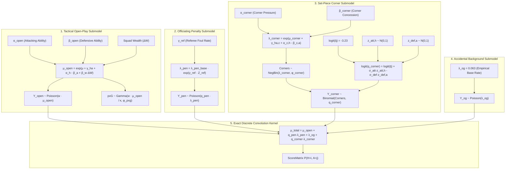

# Mathematics and Architectural Logic: 4-Way Goal Recombination with Corners & Proxy xG

**Author:** Antigravity AI  
**Module:** `current_development/scottish_lower/corners/`  
**Model Name:** `DynamicPxGCornerRecombModel`

---

## 🎯 1. Overview & Theoretical Motivation

Standard football betting models treat gross match goals as a monolithic Poisson or Negative Binomial random variable. However, match goals are generated by four fundamentally distinct physical and tactical processes:
1. **Open-Play Tactical Flow ($Y_{\text{open}}$):** Continuous territorial pressure and chance creation ($\approx 82.5\%$ of goals).
2. **Officiating Penalty Awards ($Y_{\text{pen}}$):** Discontinuous referee whistle decisions ($\approx 8.1\%$ of goals).
3. **Set-Piece Corner Scrambles ($Y_{\text{corner}}$):** Aerial box delivery and contested headers from corner kicks ($\approx 7.1\%$ of goals).
4. **Accidental Own Goals ($Y_{\text{og}}$):** Rare deflection background noise ($\approx 2.3\%$ of goals).

$$Y_{\text{total}, h} = Y_{\text{open}, h} + Y_{\text{pen}, h} + Y_{\text{og}, h} + Y_{\text{corner}, h}$$

---

## 📐 2. Mathematical Formulation

### 2.1 Tactical Open-Play Submodel with Continuous Proxy xG ($\text{pxG}$)
Let $m \in \{1, \dots, N\}$ index matches. For home team $h$ and away team $a$:
$$\log \mu_{\text{open}, h, m} = \mu_{\text{open\_base}} + \gamma_{\text{ha, open}} + \alpha_{\text{open}, h, t(m)} - \beta_{\text{open}, a, t(m)} + \beta_{\text{wealth}} \cdot \Delta W_m$$
$$\log \mu_{\text{open}, a, m} = \mu_{\text{open\_base}} + \alpha_{\text{open}, a, t(m)} - \beta_{\text{open}, h, t(m)} - \beta_{\text{wealth}} \cdot \Delta W_m$$

Observations:
$$Y_{\text{open}, h, m} \sim \text{Poisson}\left(w_m \cdot \mu_{\text{open}, h, m}\right)$$
$$\text{pxG}_{h, m} \sim \text{Gamma}\left(\text{shape} = \frac{w_m \cdot \mu_{\text{open}, h, m}}{\kappa \cdot \phi_{\text{pxg}}}, \quad \text{rate} = \frac{1}{\phi_{\text{pxg}}}\right)$$
where:
- $\Delta W_m = \log(W_h / W_a) / \sigma_W$ is the standardized starting-XI squad wealth differential.
- $\kappa \sim \text{Normal}(1.0, 0.15)$ is the finishing efficiency conversion rate.
- $w_m = \exp(-\lambda_{\text{decay}} \cdot \Delta t_m)$ is the exponential time-decay weight.

---

### 2.2 Set-Piece Corner Submodel (Negative Binomial Generation + $z$-Score Conversion)

From our empirical EDA ($p < 10^{-15}$), corner counts exhibit substantial overdispersion ($\text{Var} > \mu$).

#### A. Corner Count Generation:
$$\text{Corners}_{h, m} \sim \text{NegBin}\left(\text{mean} = \lambda_{\text{corner}, h, m}, \quad \text{dispersion} = \phi_{\text{corner}}\right)$$
$$\text{Corners}_{a, m} \sim \text{NegBin}\left(\text{mean} = \lambda_{\text{corner}, a, m}, \quad \text{dispersion} = \phi_{\text{corner}}\right)$$
where:
$$\log \lambda_{\text{corner}, h, m} = \mu_{\text{corner\_base}} + \gamma_{\text{ha, corner}} + \alpha_{\text{corner}, h} - \beta_{\text{corner}, a}$$
$$\log \lambda_{\text{corner}, a, m} = \mu_{\text{corner\_base}} + \alpha_{\text{corner}, a} - \beta_{\text{corner}, h}$$

#### B. Corner Goal Conversion ($z$-Score Non-Centered Parameterization):
$$Y_{\text{corner}, h, m} \sim \text{Binomial}\left(\text{Corners}_{h, m}, \quad q_{\text{corner}, h, a}\right)$$
$$Y_{\text{corner}, a, m} \sim \text{Binomial}\left(\text{Corners}_{a, m}, \quad q_{\text{corner}, a, h}\right)$$
where:
$$\text{logit}(q_{\text{corner}, h, a}) = \text{logit}(\bar{q}) + \sigma_{\text{att}} \cdot \tilde{\eta}_{\text{att}, h} - \sigma_{\text{def}} \cdot \tilde{\zeta}_{\text{def}, a}$$
$$\text{logit}(q_{\text{corner}, a, h}) = \text{logit}(\bar{q}) + \sigma_{\text{att}} \cdot \tilde{\eta}_{\text{att}, a} - \sigma_{\text{def}} \cdot \tilde{\zeta}_{\text{def}, h}$$

**Priors on Standardized $z$-Scores:**
$$\tilde{\eta}_{\text{att}, i} \sim \mathcal{N}(0, 1) \quad (\text{Standardized Attacking Aerial Finishing Ability})$$
$$\tilde{\zeta}_{\text{def}, j} \sim \mathcal{N}(0, 1) \quad (\text{Standardized Defensive Aerial Resistance})$$
$$\sigma_{\text{att}} \sim \text{HalfNormal}(0.30), \quad \sigma_{\text{def}} \sim \text{HalfNormal}(0.30)$$
$$\bar{q} = 0.038 \implies \text{logit}(\bar{q}) = \ln\left(\frac{0.038}{1 - 0.038}\right) \approx -3.23$$

---

### 2.3 Exact 4-Way Discrete Poisson Convolution

By the reproductive property of independent Poisson processes, the sum of open-play goals, penalty awards, accidental own goals, and expected corner goals is Poisson:

$$\mu_{\text{total}, h} = \mu_{\text{open}, h} + q_{\text{pen}} \cdot \lambda_{\text{pen}, h} + \lambda_{\text{og}} + q_{\text{corner}, h, a} \cdot \lambda_{\text{corner}, h, a}$$
$$\mu_{\text{total}, a} = \mu_{\text{open}, a} + q_{\text{pen}} \cdot \lambda_{\text{pen}, a} + \lambda_{\text{og}} + q_{\text{corner}, a, h} \cdot \lambda_{\text{corner}, a, h}$$

#### Out-of-Sample Score Matrix Computation:
For score line $(g_h, g_a) \in \{0, \dots, G_{\max}\} \times \{0, \dots, G_{\max}\}$:
$$P(H = g_h) = \frac{\mu_{\text{total}, h}^{g_h} e^{-\mu_{\text{total}, h}}}{g_h!}, \quad P(A = g_a) = \frac{\mu_{\text{total}, a}^{g_a} e^{-\mu_{\text{total}, a}}}{g_a!}$$
$$S_{g_h, g_a} = \frac{P(H = g_h) \cdot P(A = g_a)}{\sum_{i=0}^{G_{\max}} P(H = i) \sum_{j=0}^{G_{\max}} P(A = j)}$$
guaranteeing $\sum_{i,j} S_{i,j} = 1.000000$ exactly across any arbitrary truncation $G_{\max}$.

---

## ⚡ 3. ReverseDiff AD Stability & Memory Rules

To maintain high-performance NUTS sampling on `mcmc-beast` (32 cores):

1. **Zero-Allocation Binary Masking:**
   Missing observations (e.g. historical matches without live commentary) are imputed with dummy constants ($1.0$) and multiplied by binary indicator vectors (`mask_corners`, `mask_pxg`), preventing dynamic branch rebuilds during ReverseDiff tape execution.
2. **Logit Clamping:**
   $$\text{logit}(q) \in [-6.0, 0.0] \iff q \in [0.00247, 0.50000]$$
   Prevents gradient underflows in Binomial likelihoods.
3. **Thread Pinning:**
   All sampling runs execute with `ThreadPinning.pinthreads(:cores)` to lock worker threads to physical CPU cores, eliminating cache-thrashing across Julia tasks.
