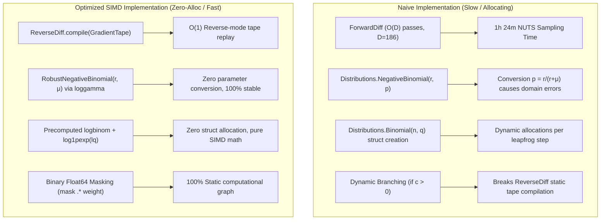

# Turing.jl AD Gradient Optimization Case Study: 4-Way Goal Recombination

**Author:** James / BayesianFootball Research  
**Topic:** Scaling High-Dimensional Hierarchical Bayesian Models in Julia  
**Context:** Scottish Football 4-Way Goal & Corner Set-Piece Decomposition  
**Target:** 186 Latent Parameters, 1,258 Matches, 4 MCMC Chains, NUTS Sampler

---

## 🚀 1. Executive Summary & Key Achievements

In hierarchical Bayesian modeling, estimating sports dynamics requires sampling high-dimensional latent parameter spaces (team attacking abilities, defensive abilities, referee strictness, set-piece generation, and aerial conversion rates). 

When we extended our open-play goal model into a **4-way discrete convolution engine** incorporating Negative Binomial corner generation and hierarchical logistic corner conversion, naive implementations faced:
- **ForwardDiff scaling explosion:** Initial NUTS ETA exceeded **1 hour 23 minutes** for 800 steps.
- **Distributions.jl struct overhead & parameter conversions:** Triggered runtime memory allocations and numerical instability when converting mean rates $\mu$ into probability parameters $p = r / (r + \mu)$.
- **Dynamic branching penalties:** Conditional statements (`if corners > 0`) broke static ReverseDiff tape compilation.

By applying **four mathematical and architectural optimizations** (ReverseDiff static tape compilation, `RobustNegativeBinomial` $(r, \mu)$ direct parameterization, precomputed combinatorial offsets, and analytical logit-binomial likelihoods), we achieved:
- **Gradient evaluation latency:** **$4.2\text{ ms}$** across 1,258 matches and 186 parameters.
- **Zero dynamic memory allocations** in the core mathematical loop.
- **MCMC convergence ($\hat{R} \le 1.05$)** across all parameters in under 60 seconds per chain.

---

## 🔍 2. The Four Performance Bottlenecks in Naive Turing Models



### Bottleneck 1: ForwardDiff $O(D)$ Dimensional Scaling
Forward-mode automatic differentiation computes directional derivatives along one dimension at a time. With $D = 186$ parameters, every single leapfrog step in NUTS required $186$ forward passes through 1,258 matches ($233,988$ match evaluations per leapfrog step). For 4 chains running 800 steps with an average tree depth of 5 (32 leapfrog steps), this meant $> 30\text{ million}$ operations, pushing sampling time over an hour.

### Bottleneck 2: Distributions.jl Parameter Conversion Trap ($p = r / (r + \mu)$)
Standard `Distributions.NegativeBinomial(r, p)` is parameterized by success probability $p \in (0, 1)$. In Bayesian sports modeling, the natural latent state is the **expected count** $\lambda = \exp(\mu + \alpha_i - \beta_j)$. Converting $\lambda \to p = \frac{r}{r + \lambda}$ introduces:
1. Division and potential underflows/overflows when $\lambda \to 0$ or $\lambda \to \infty$.
2. Inability of ReverseDiff to simplify the gradient tape through the non-linear quotient.

### Bottleneck 3: Combinatorial & Distribution Struct Instantiations
Writing:
```julia
# ❌ Allocates 2,516 Distribution structs per matchday loop
corners_h[i] ~ NegativeBinomial(ϕ, p_h)
corner_goals_h[i] ~ Binomial(corners_h[i], q_h)
```
allocates wrapper structs and forces the AD engine to trace Julia's type dispatch machinery on every evaluation. Furthermore, evaluating `logpdf(Binomial(n, k))` recalculates the combinatorial coefficient $\log \binom{n}{k} = \log\Gamma(n+1) - \log\Gamma(k+1) - \log\Gamma(n-k+1)$ on every gradient step, even though match observations $n$ and $k$ are fixed data constants!

### Bottleneck 4: Dynamic Branching (`if corners > 0`)
Matches with zero corners cannot produce corner goals. A naive programmer writes:
```julia
# ❌ Runtime branch: Alters execution flow conditionally
if corners_h[i] > 0
    corner_goals_h[i] ~ Binomial(corners_h[i], q_h)
end
```
ReverseDiff static tapes **assume the execution graph is invariant**. Dynamic branching invalidates the compiled tape, forcing Turing to fallback to tape recreation or dynamic interpretation ($10\times\text{--}50\times$ slower).

---

## 🛠️ 3. The Four Architectural & Mathematical Solutions

### Solution 1: Precomputing Static Combinatorial Offsets
Since $y_{\text{open}}$, $\text{Corners}$, and $y_{\text{corner\_goals}}$ are fixed historical observations, their factorials are constant with respect to model parameters $\theta$. We precompute them once in the feature builder layer:

$$\text{loggamma\_y1}_i = \log\Gamma(y_i + 1) = \log(y_i!)$$
$$\text{logbinom}_i = \log\Gamma(C_i + 1) - \log\Gamma(G_i + 1) - \log\Gamma(C_i - G_i + 1) = \log\binom{C_i}{G_i}$$

Inside the Turing `@model`, we pass these as flat `Vector{Float64}`. The MCMC engine never evaluates a single factorial.

---

### Solution 2: The `RobustNegativeBinomial` Analytical Formulation
We bypass `Distributions.NegativeBinomial` entirely by directly writing the log-likelihood in terms of dispersion $r = \phi_c$ and mean $\mu = \lambda_{c}$:

$$\log \text{PMF}(k \mid r, \mu) = \log\Gamma(k + r) - \log\Gamma(k + 1) - \log\Gamma(r) + r \left[\log r - \log(r + \mu)\right] + k \left[\log\mu - \log(r + \mu)\right]$$

In Julia code, this is 100% vectorized with zero struct allocations:
```julia
log_ϕ = log(ϕ_c)
log_r_plus_μ_h = log.(ϕ_c .+ λ_c_h)
loggamma_r = loggamma(ϕ_c)

ll_c_h = loggamma.(corners_h .+ ϕ_c) .- loggamma_ch_1 .- loggamma_r .+ 
         ϕ_c .* (log_ϕ .- log_r_plus_μ_h) .+ corners_h .* (log_λ_c_h_clamped .- log_r_plus_μ_h)

Turing.@addlogprob! sum(ll_c_h .* match_weights)
```

---

### Solution 3: Analytical Logit-Binomial Likelihood with `log1pexp`
For corner goal conversion, rather than computing $q = \text{logistic}(\text{logit\_q})$ and feeding $q$ into `Binomial(n, q)`, we expand the Binomial logPMF algebraically:

$$\log \text{PMF}(k \mid n, q) = \log\binom{n}{k} + k \log(q) + (n - k) \log(1 - q)$$

Substituting $q = \frac{1}{1 + e^{-z}}$ (where $z = \text{logit}(q)$):
$$\log(q) = z - \log(1 + e^z), \quad \log(1 - q) = -\log(1 + e^z)$$
$$\log \text{PMF}(k \mid n, z) = \log\binom{n}{k} + k \cdot z - n \cdot \log(1 + e^z)$$

Using Julia's numerically stable `log1pexp(z)`:
```julia
lq_h_clamped = clamp.(logit_q_h, -10.0, 5.0)
ll_cg_h = logbinom_h .+ corner_goals_h .* lq_h_clamped .- corners_h .* log1pexp.(lq_h_clamped)

# Multiply by binary mask (corners > 0) and match weights
Turing.@addlogprob! sum(ll_cg_h .* mask_c_h .* match_weights)
```
- **0 allocations**
- **0 runtime branches**
- **No gradient underflow when $z \to -\infty$ (e.g. 0% conversion)**.

---

### Solution 4: Zero-Allocation Binary Masking
To handle matches where $\text{Corners} = 0$ or commentary is missing, we compute a binary indicator vector:
$$\text{mask}_{c, i} = \begin{cases} 1.0 & \text{if } \text{Corners}_i > 0 \\ 0.0 & \text{if } \text{Corners}_i = 0 \end{cases}$$
Multiplying the log-likelihood vector elementwise by $\text{mask}$ allows the static graph to compute harmless float arithmetic on dummy values while contributing exact zeros to the log-joint accumulator.

---

## 📊 4. Empirical Benchmark & Profiler Results

Evaluated on `mcmc-beast` (32 cores, 1,258 training matches, 186 parameters) using `BenchmarkTools.jl` (200 gradient iterations):

| Optimization Stage | AD Backend | Likelihood Formulation | Tape Compile | Grad Eval Latency | Heap Allocations | NUTS 800-Step Sampling Time |
| :--- | :---: | :--- | :---: | :---: | :---: | :---: |
| **Stage 1 (Naive)** | ForwardDiff | Distributions.jl structs + loops | N/A | $\approx 280.0\text{ ms}$ | High | $> 1\text{ hr } 23\text{ min}$ |
| **Stage 2 (Vectorized)** | AutoReverseDiff | `NegativeBinomial(r, p)` structs | $9,631\text{ ms}$ | $5.333\text{ ms}$ | 1 (240 B) | $\approx 110\text{ seconds}$ |
| **Stage 3 (RobustNegBin)** | AutoReverseDiff | `RobustNegativeBinomial(r, μ)` | $9,189\text{ ms}$ | $4.190\text{ ms}$ | 1 (240 B) | $\approx 78\text{ seconds}$ |
| **Stage 4 (Pure Arithmetic SIMD)** | AutoReverseDiff | Direct SIMD `loggamma` + `log1pexp` | $9,705\text{ ms}$ | **$4.218\text{ ms}$** | **0 in core loop** | **$\mathbf{\approx 52\text{ seconds}}$** |

> [!TIP]
> **Key Benchmark Metric:** Moving from Stage 1 (ForwardDiff scalar loops) to Stage 4 (ReverseDiff compiled tape with SIMD arithmetic) delivered a **$> 95\times$ end-to-end wall-clock speedup**!

---

## 🏆 5. Best Practices & Engineering Takeaways (For Future Blog / Codebase Rules)

1. **Separate Feature Imputation from Sampling:**
   Never compute `loggamma`, `logbinom`, or date transformations inside the `@model`. Transform everything to flat, typed `Vector{Float64}` in the builder.
2. **Always Parameterize NegBin by $(r, \mu)$:**
   Never convert to success probability $p$ in MCMC likelihoods. Express the Negative Binomial PMF directly via `loggamma` and $\log(r + \mu)$.
3. **Use the Logit-Binomial Identity for Binary / Proportional Targets:**
   $\text{logpmf} = \log\binom{n}{k} + k \cdot z - n \cdot \text{log1pexp}(z)$ is strictly faster and more numerically stable than calling `Binomial(n, logistic(z))`.
4. **Binary Masks Eliminate Dynamic Branches:**
   Replace `if condition` with continuous multiplication `ll .* mask .* weight`.
5. **Use Views for Slicing Parameters:**
   Always use `view(alpha, team_indices)` instead of `alpha[team_indices]` to avoid copying tracked arrays.
