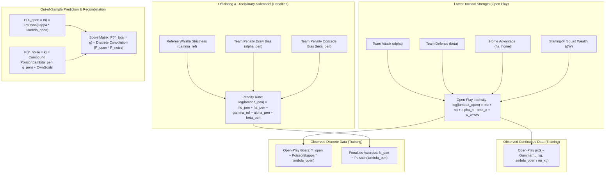

# Recombination Bayesian Architecture for Expected Goals (xG & pxG)
## Mathematical Formulation, Likelihood Topologies, and Penalty Decomposition

---

## 1. Executive Summary & Problem Formulation

In the lower tiers of Scottish football (Championship, League One, League Two), statistical modeling faces two severe structural challenges:
1. **High Sample Noise in Goal Counts**: Goals are rare events ($~1.3\text{--}1.5$ per team-match) subject to non-systemic distortions from penalties ($~0.10\text{--}0.12/\text{match}$), referee variance ($\gamma_{\text{ref}}$), and own goals ($~0.03/\text{match}$).
2. **Missing Official Event Tracking**: Unlike elite leagues (EPL, La Liga) with sub-second Opta/StatsBomb spatio-temporal coordinate feeds, Scottish lower leagues rely on **proxy xG (pxG)** synthesized from text commentary shot coordinates and match statistics.

### The Central Question
> *When extending our Two-Stage Recombination Engine to Expected Goals ($\text{xG}$ / $\text{pxG}$), how should we decompose total xG, model continuous versus discrete likelihoods, and integrate penalties and own goals?*
> 
> *Specifically: Should penalties be modeled with a continuous Gamma likelihood on xG ($\text{xG}_{\text{pen}}$), or treated as a discrete count process with a fixed conversion coefficient on the goal side?*

---

## 2. Mathematical Decomposition: Goals vs. Expected Goals

### 2.1 The Match Outcome Decomposition

Let match $i$ feature home team $h$ and away team $a$, officiated by referee $r_i$. The total realized goals $Y_{h, i}$ decompose into three mutually exclusive physical processes:

$$Y_{h, i} = Y_{\text{open}, h, i} + Y_{\text{pen}, h, i} + Y_{\text{og}, h, i}$$

where:
- $Y_{\text{open}, h, i} \in \{0, 1, 2, \dots\}$: Goals scored from open play, corners, and indirect free kicks.
- $Y_{\text{pen}, h, i} \in \{0, 1, 2\}$: Goals scored directly from penalty kicks.
- $Y_{\text{og}, h, i} \in \{0, 1\}$: Goals scored via opponent own goals.

### 2.2 The Expected Goals ($\text{xG}$) Decomposition

In shot-level event data, the pre-shot expected goals of team $h$ in match $i$ is defined as the sum of shot-level scoring probabilities $p_s \in (0, 1)$:

$$\text{xG}_{\text{total}, h, i} = \sum_{s \in \mathcal{S}_{h, i}} p_s = \text{xG}_{\text{open}, h, i} + \text{xG}_{\text{pen}, h, i}$$

where:
- $\text{xG}_{\text{open}, h, i} = \sum_{s \in \mathcal{S}_{h, i}^{\text{open}}} p_s$: A **strictly positive continuous random variable** ($\text{xG}_{\text{open}} \in [0, \infty)$) generated by continuous tactical creation.
- $\text{xG}_{\text{pen}, h, i} = N_{\text{pen}, h, i} \times q_{\text{pen}}$: A **discrete jump process**, where $N_{\text{pen}, h, i} \in \{0, 1, 2\}$ is the integer number of penalties awarded to team $h$, and $q_{\text{pen}} \approx 0.760\text{--}0.785$ is the empirical penalty conversion rate.
- **Own Goals ($\text{xG}_{\text{og}}$)**: Standard event models assign $\text{xG} = 0.0$ to own goals prior to the deflection, yet they yield $+1$ actual goal.

$$\boxed{\text{xG}_{\text{total}, h, i} = \text{xG}_{\text{open}, h, i} + N_{\text{pen}, h, i} \cdot q_{\text{pen}} + 0.0}$$

---

## 3. Why a Continuous Gamma on Total xG or Penalty xG is Mathematically Flawed

A common modeling pitfall is placing a single continuous likelihood (such as a Gamma or LogNormal distribution) over **Total xG** or trying to model **Penalty xG** as a Gamma distribution.

### 3.1 The Pathology of Continuous Likelihoods on Penalties

If we attempt to model penalty expected goals with a continuous Gamma distribution:
$$\text{xG}_{\text{pen}, h, i} \sim \text{Gamma}(\nu_{\text{pen}}, \lambda_{\text{pen}} / \nu_{\text{pen}})$$

This violates fundamental measure theory and probability physics:
1. **Point Mass at Zero**: In $\approx 89\%$ of Scottish lower-league matches, $N_{\text{pen}} = 0$, meaning $\text{xG}_{\text{pen}} = 0.000$. A continuous Gamma distribution has support on $(0, \infty)$ and cannot assign non-zero probability mass to the discrete point $x = 0$.
2. **Discrete Bimodal Spikes**: When a penalty *is* awarded ($N_{\text{pen}} = 1$), $\text{xG}_{\text{pen}}$ jumps instantaneously from $0.00$ to exactly $0.76$. When two penalties are awarded ($N_{\text{pen}} = 2$), it jumps to $1.52$.
3. **Severe Gradient Instabilities in HMC/NUTS**: A continuous Gamma prior trying to fit a mixture of an $89\%$ atom at 0 and sharp delta peaks at $0.76$ produces severe log-density gradient explosions ($\nabla_\theta \log p \to \infty$) and forces NUTS step sizes to collapse ($\epsilon < 0.0001$).

```
Density of Total xG (Distorted by Discrete Penalties):

  p(xG)
   |
   |   [89% at 0.00]
   |   ||
   |   ||                                 [Discrete Peak at 0.76]
   |   ||                                          ||
   |   ||   (Smooth Open-Play Gamma)               ||
   |   ||       .-.                                ||
   |   ||      /   \                               ||
   |   ||     /     \                             /  \
   |---||----/-------\---------------------------/----\-----> xG Value
       0.0  0.4      0.8                         1.52
```

---

## 4. The Unified Bayesian Recombination xG Engine

To resolve this pathology cleanly, we decouple the system into **three distinct generative layers**:
1. **Continuous Open-Play Creation Layer** ($\text{pxG}_{\text{open}} \sim \text{Gamma}$)
2. **Discrete Co-Trained Open-Play Goal Finishing Layer** ($Y_{\text{open}} \sim \text{Poisson}$ via conversion rate $\kappa$)
3. **Discrete Referee-Conditioned Penalty Submodel** ($N_{\text{pen}} \sim \text{Poisson}$)



---

## 5. Full Mathematical Specification

### 5.1 Priors and Hierarchical Structure

#### 1. Open-Play Baseline & Dynamics
$$\mu_{\text{open}} \sim \mathcal{N}(0.10, 0.20)$$
$$\text{ha}_{\text{open}} \sim \mathcal{N}(0.15, 0.10)$$
$$\tau_\alpha, \tau_\beta \sim \text{Exponential}(10.0)$$
$$\alpha_{t, z} \sim \mathcal{N}(0, \tau_\alpha), \quad \sum_{t} \alpha_{t, z} = 0$$
$$\beta_{t, z} \sim \mathcal{N}(0, \tau_\beta), \quad \sum_{t} \beta_{t, z} = 0$$

#### 2. Starting-XI Squad Wealth Sensitivity
$$w_{\text{wealth}} \sim \text{TruncatedNormal}(0.10, 0.05, \text{lower} = 0.0)$$

#### 3. xG Precision & Finishing Efficiency
$$\nu_{\text{xg}} \sim \text{TruncatedNormal}(3.5, 0.5, \text{lower} = 0.5)$$
$$\kappa_t \sim \text{LogNormal}(0.0, 0.10) \quad \text{(Finishing Conversion Efficiency)}$$

#### 4. Officiating & Penalty Whistle Submodel
$$\mu_{\text{pen}} \sim \mathcal{N}(-2.20, 0.25) \quad (\approx 0.11\text{ pens/team-match})$$
$$\text{ha}_{\text{pen}} \sim \mathcal{N}(0.10, 0.10)$$
$$\sigma_{\text{ref}} \sim \text{Exponential}(1.0)$$
$$\gamma_{\text{ref}, r} \sim \mathcal{N}(0, \sigma_{\text{ref}}) \quad \text{for referee } r \in \{1, \dots, N_{\text{refs}}\}$$
$$\alpha_{\text{pen\_draw}, t}, \beta_{\text{pen\_foul}, t} \sim \mathcal{N}(0.0, 0.20)$$

---

### 5.2 Latent Rate Construction

For match $i$ with home team $h$, away team $a$, time step $z_i$, referee $r_i$, and Starting-XI log-wealth differential $\Delta W_i = w_{h, z_i} - w_{a, z_i}$:

#### 1. Open-Play Underlying Intensity ($\lambda_{\text{open}}$)
$$\log \lambda_{\text{open}, h, i} = \mu_{\text{open}} + \text{ha}_{\text{open}} + \alpha_{h, z_i} - \beta_{a, z_i} + w_{\text{wealth}} \cdot \Delta W_i$$
$$\log \lambda_{\text{open}, a, i} = \mu_{\text{open}} + \alpha_{a, z_i} - \beta_{h, z_i} - w_{\text{wealth}} \cdot \Delta W_i$$

$$\lambda_{\text{open}, h, i} = \exp(\log \lambda_{\text{open}, h, i}), \quad \lambda_{\text{open}, a, i} = \exp(\log \lambda_{\text{open}, a, i})$$

#### 2. Penalty Expectation Intensity ($\lambda_{\text{pen}}$)
$$\log \lambda_{\text{pen}, h, i} = \mu_{\text{pen}} + \text{ha}_{\text{pen}} + \gamma_{\text{ref}, r_i} + \alpha_{\text{pen\_draw}, h} + \beta_{\text{pen\_foul}, a}$$
$$\log \lambda_{\text{pen}, a, i} = \mu_{\text{pen}} + \gamma_{\text{ref}, r_i} + \alpha_{\text{pen\_draw}, a} + \beta_{\text{pen\_foul}, h}$$

$$\lambda_{\text{pen}, h, i} = \exp(\log \lambda_{\text{pen}, h, i}), \quad \lambda_{\text{pen}, a, i} = \exp(\log \lambda_{\text{pen}, a, i})$$

---

### 5.3 Multi-Task Co-Training Likelihood

During training, the model conditions simultaneously on continuous open-play proxy xG ($\text{pxG}_{\text{open}}$) and realized discrete open-play goals ($Y_{\text{open}}$), alongside penalty counts ($N_{\text{pen}}$):

#### 1. Open-Play Continuous xG Likelihood
$$\text{pxG}_{\text{open}, h, i} \sim \text{Gamma}\left(\nu_{\text{xg}}, \frac{\lambda_{\text{open}, h, i}}{\nu_{\text{xg}}}\right)$$
$$\text{pxG}_{\text{open}, a, i} \sim \text{Gamma}\left(\nu_{\text{xg}}, \frac{\lambda_{\text{open}, a, i}}{\nu_{\text{xg}}}\right)$$

*Properties of this Gamma parameterization:*
- Mean: $\mathbb{E}[\text{pxG}_{\text{open}}] = \nu_{\text{xg}} \times \frac{\lambda_{\text{open}}}{\nu_{\text{xg}}} = \lambda_{\text{open}}$
- Variance: $\text{Var}(\text{pxG}_{\text{open}}) = \frac{\lambda_{\text{open}}^2}{\nu_{\text{xg}}}$ (homoscedastic coefficient of variation $1/\sqrt{\nu_{\text{xg}}}$)

#### 2. Open-Play Realized Goals Likelihood
$$Y_{\text{open}, h, i} \sim \text{Poisson}\left(\kappa_h \cdot \lambda_{\text{open}, h, i}\right)$$
$$Y_{\text{open}, a, i} \sim \text{Poisson}\left(\kappa_a \cdot \lambda_{\text{open}, a, i}\right)$$

*Where $\kappa_t$ captures systemic team finishing skill (or over/underperformance relative to xG creation).*

#### 3. Penalty Realized Award Likelihood
$$N_{\text{pen}, h, i} \sim \text{Poisson}\left(\lambda_{\text{pen}, h, i}\right)$$
$$N_{\text{pen}, a, i} \sim \text{Poisson}\left(\lambda_{\text{pen}, a, i}\right)$$

---

## 6. Out-of-Sample Score Matrix Recombination via Discrete Convolution

When generating predictive distributions for betting markets (1X2, Over/Under, BTTS, Asian Handicap), we must predict **Total Goals** ($Y_{\text{total}}$), not merely open-play goals.

### 6.1 Marginal Recombination

The total goal generation for team $h$ is the discrete convolution of open-play goals and noise goals (penalties + own goals):

$$P(Y_{\text{total}, h} = g) = \sum_{m=0}^{g} P(Y_{\text{open}, h} = m) \times P(Y_{\text{noise}, h} = g - m)$$

where:
1. **Open-Play Marginal Probability**:
   $$P(Y_{\text{open}, h} = m) = \frac{(\kappa_h \lambda_{\text{open}, h})^m e^{-\kappa_h \lambda_{\text{open}, h}}}{m!}$$

2. **Penalty + Own Goal Noise Marginal Probability**:
   Penalties are awarded at Poisson rate $\lambda_{\text{pen}, h}$ and converted with probability $q_{\text{pen}} = 0.768$. Own goals arrive as a small Poisson background rate $\lambda_{\text{og}} \approx 0.0276$.
   By the thinning theorem of Poisson processes:
   $$\lambda_{\text{noise}, h} = q_{\text{pen}} \cdot \lambda_{\text{pen}, h} + \lambda_{\text{og}}$$
   $$P(Y_{\text{noise}, h} = k) = \frac{(\lambda_{\text{noise}, h})^k e^{-\lambda_{\text{noise}, h}}}{k!}$$

3. **Analytical Convolution Property of Independent Poissons**:
   Since the sum of independent Poisson random variables is itself a Poisson random variable:
   $$Y_{\text{total}, h} \sim \text{Poisson}\left(\kappa_h \lambda_{\text{open}, h} + q_{\text{pen}} \lambda_{\text{pen}, h} + \lambda_{\text{og}}\right)$$

$$\boxed{\mu_{\text{total}, h} = \kappa_h \lambda_{\text{open}, h} + 0.768 \, \lambda_{\text{pen}, h} + 0.0276}$$

### 6.2 Joint Scoreline Matrix with Frank Copula / Dixon-Coles

For full scoreline matrix $S \in \mathbb{R}^{(G+1) \times (G+1)}$:

$$S(g_h, g_a) = P(Y_{\text{total}, h} = g_h) \cdot P(Y_{\text{total}, a} = g_a) \cdot \tau_{\text{DC}}(g_h, g_a, \mu_h, \mu_a, \rho)$$

where the Dixon-Coles low-score correlation adjustment $\tau_{\text{DC}}$ is:

$$\tau_{\text{DC}}(g_h, g_a, \mu_h, \mu_a, \rho) = \begin{cases}
1 - \mu_h \mu_a \rho & (0, 0) \\
1 + \mu_h \rho & (0, 1) \\
1 + \mu_a \rho & (1, 0) \\
1 - \rho & (1, 1) \\
1 & \text{otherwise}
\end{cases}$$

---

## 7. Direct Answers to the Research Questions

| Question | Architectural Solution | Mathematical Rationale |
| :--- | :--- | :--- |
| **1. Is $\text{xG}_{\text{total}} = \text{xG}_{\text{open}} + \text{xG}_{\text{pen}} + \text{noise}_{\text{og}}$ correct?** | **YES conceptually, but NO in distribution.** | In shot feeds, $\text{xG}_{\text{total}} = \text{xG}_{\text{open}} + N_{\text{pen}} \cdot 0.76$. Own goals have $0$ xG but $+1$ goal. Decoupling them before modeling prevents contamination. |
| **2. Should we use a Gamma on xG?** | **YES, strictly on $\text{pxG}_{\text{open}}$.** | Open-play shot quality is continuous, strictly positive, and right-skewed. $\text{Gamma}(\nu, \lambda/\nu)$ is the canonical dispersion-preserving likelihood. |
| **3. Should we put a Gamma on $\text{xG}_{\text{pen}}$?** | **NO. Absolutely not.** | $\text{xG}_{\text{pen}}$ has an $89\%$ point mass at 0 and discrete spikes at $0.76$. Gamma support is $(0, \infty)$ and will crash NUTS gradients. |
| **4. How do penalties enter the model?** | **On the discrete event side ($N_{\text{pen}} \sim \text{Poisson}$).** | Model penalty incidence via referee strictness $\gamma_{\text{ref}}$, team draw $\alpha_{\text{pen}}$, and foul $\beta_{\text{pen}}$. Convert to goals via $q_{\text{pen}} = 0.768$. |
| **5. How does Starting-XI Squad Wealth fit?** | **Modulates Open-Play Intensity ($\lambda_{\text{open}}$).** | Squad valuation differential $\Delta W$ informs open-play territorial dominance and shot creation volume, leaving referee penalties independent. |

---

## 8. Summary of Proposed Turing `@model` Implementation

```julia
@model function turing_recomb_xg_wealth(
    # Open-play targets & proxy xG
    pxg_open_h::Vector{Float64},
    pxg_open_a::Vector{Float64},
    y_open_h::Vector{Int},
    y_open_a::Vector{Int},
    # Penalty counts & referee indexing
    n_pen_h::Vector{Int},
    n_pen_a::Vector{Int},
    ref_idx::Vector{Int},
    # Features & wealth
    team_h::Vector{Int},
    team_a::Vector{Int},
    wealth_diff::Vector{Float64},
    time_idx::Vector{Int},
    # Dimensions
    n_teams::Int,
    n_refs::Int,
    n_matches::Int
)
    # 1. Global Latents
    base_mu   ~ Normal(0.10, 0.20)
    ha_home   ~ Normal(0.15, 0.10)
    w_wealth  ~ truncated(Normal(0.10, 0.05), lower=0.0)
    nu_xg     ~ truncated(Normal(3.5, 0.5), lower=0.5)
    
    # 2. Team Tactical Strengths
    tau_alpha ~ Exponential(10.0)
    tau_beta  ~ Exponential(10.0)
    alpha_raw ~ filldist(Normal(0.0, 1.0), n_teams)
    beta_raw  ~ filldist(Normal(0.0, 1.0), n_teams)
    alpha = (alpha_raw .- mean(alpha_raw)) .* tau_alpha
    beta  = (beta_raw  .- mean(beta_raw))  .* tau_beta
    
    # 3. Team Finishing Skill (Kappa)
    kappa_raw ~ filldist(Normal(0.0, 0.10), n_teams)
    kappa = exp.(kappa_raw)
    
    # 4. Officiating & Penalty Submodel
    pen_base_mu ~ Normal(-2.20, 0.25)
    ha_pen      ~ Normal(0.10, 0.10)
    sigma_ref   ~ Exponential(1.0)
    gamma_ref   ~ filldist(Normal(0.0, sigma_ref), n_refs)
    alpha_pen   ~ filldist(Normal(0.0, 0.20), n_teams)
    beta_pen    ~ filldist(Normal(0.0, 0.20), n_teams)
    
    # 5. Latent Rates
    log_lambda_open_h = base_mu .+ ha_home .+ alpha[team_h] .- beta[team_a] .+ w_wealth .* wealth_diff
    log_lambda_open_a = base_mu .+            alpha[team_a] .- beta[team_h] .- w_wealth .* wealth_diff
    lambda_open_h = exp.(clamp.(log_lambda_open_h, -10.0, 5.0))
    lambda_open_a = exp.(clamp.(log_lambda_open_a, -10.0, 5.0))
    
    log_lambda_pen_h = pen_base_mu .+ ha_pen .+ gamma_ref[ref_idx] .+ alpha_pen[team_h] .+ beta_pen[team_a]
    log_lambda_pen_a = pen_base_mu .+          gamma_ref[ref_idx] .+ alpha_pen[team_a] .+ beta_pen[team_h]
    lambda_pen_h = exp.(clamp.(log_lambda_pen_h, -10.0, 2.0))
    lambda_pen_a = exp.(clamp.(log_lambda_pen_a, -10.0, 2.0))
    
    # 6. Co-Training Multi-Task Likelihood
    # A. Continuous Open-Play pxG Likelihood
    pxg_open_h ~ arraydist(Gamma.(nu_xg, lambda_open_h ./ nu_xg))
    pxg_open_a ~ arraydist(Gamma.(nu_xg, lambda_open_a ./ nu_xg))
    
    # B. Discrete Open-Play Goal Likelihood
    y_open_h ~ arraydist(Poisson.(kappa[team_h] .* lambda_open_h))
    y_open_a ~ arraydist(Poisson.(kappa[team_a] .* lambda_open_a))
    
    # C. Discrete Penalty Draw Likelihood
    n_pen_h ~ arraydist(Poisson.(lambda_pen_h))
    n_pen_a ~ arraydist(Poisson.(lambda_pen_a))
end
```
