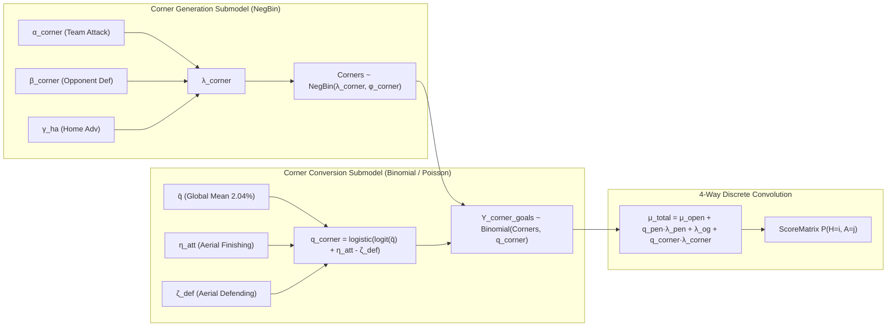

# Empirical Findings: Corner Kick & Set-Piece Decomposition EDA

**Dataset:** Scottish Football (Premiership 54, Championship 55, League One 56, League Two 57)  
**Sample Size:** 4,228 Matches (2020/21 – 2026/27), 11,421 Total Goals, 40,715 Corner Kicks  
**Execution Node:** `mcmc-beast` (32 cores)

---

## 📊 1. Macro 4-Way Goal Decomposition Breakdown

Across 4,228 matches in Scottish football, total match goals decompose into:

| Goal Component | Total Goals | % of Total Match Goals | Mean Goals / Match |
| :--- | :---: | :---: | :---: |
| **1. Open-Play Tactical Goals ($Y_{\text{open}}$)** | 9,419 | **82.47%** | 2.228 |
| **2. Penalty Whistle Goals ($Y_{\text{pen}}$)** | 924 | **8.09%** | 0.219 |
| **3. Corner Set-Piece Goals ($Y_{\text{corner}}$)** | 813 | **7.12%** | 0.192 |
| **4. Accidental Own Goals ($Y_{\text{og}}$)** | 265 | **2.32%** | 0.063 |
| **Total Gross Match Goals ($Y_{\text{total}}$)** | **11,421** | **100.00%** | **2.701** |

> [!IMPORTANT]
> **Key Finding 1:** Corner goals account for **7.12% of all goals in Scottish football**, virtually matching the volume of penalties (8.09%). Isolating corners leaves **82.47% pure open-play goals**, stripping out high-variance aerial scrambles from tactical attacking/defensive ratings.

---

## 📈 2. Corner Generation Distribution & Overdispersion Analysis

| Tournament Tier | Matches | Mean Corners/Match | Home Corners | Away Corners | Home Adv Ratio | Dispersion Index ($\frac{\text{Var}}{\mu}$) | $p$-value (vs Poisson) |
| :--- | :---: | :---: | :---: | :---: | :---: | :---: | :---: |
| **Scottish Premiership (54)** | 1,200 | 10.46 | 5.60 | 4.86 | **1.15x** (+0.74) | **1.82** | $p < 10^{-15}$ (Overdispersed) |
| **Scottish Championship (55)** | 1,040 | 9.32 | 5.05 | 4.28 | **1.18x** (+0.77) | **2.07** | $p < 10^{-15}$ (Overdispersed) |
| **Scottish League One (56)** | 994 | 9.74 | 5.11 | 4.62 | **1.11x** (+0.49) | **1.67** | $p < 10^{-15}$ (Overdispersed) |
| **Scottish League Two (57)** | 994 | 9.33 | 4.94 | 4.39 | **1.13x** (+0.56) | **1.51** | $p < 10^{-15}$ (Overdispersed) |

### Key Mathematical Takeaways:
1. **Negative Binomial Requirement:** Across all four divisions, the index of dispersion ($\frac{\text{Var}}{\mu}$) is significantly greater than $1.0$ ($1.51\text{--}2.07, p < 10^{-15}$). Corner count generation **must be modeled with a Negative Binomial likelihood** ($\text{NegBin}(\lambda, \phi)$) rather than standard Poisson.
2. **Consistent Home Advantage:** Home teams consistently generate **1.11x to 1.18x more corners** than away teams ($+0.49$ to $+0.77$ corners, $t = 3.45\text{--}5.78, p < 0.0001$).
3. **Corner Total vs Goal Total Independence:** $\text{Cor}(\text{Total Corners}, \text{Total Goals}) = +0.0096$. Match corner volume does *not* imply high gross goal volume because open-play finishing and corner award volume are orthogonal tactical processes.

---

## 🎯 3. Team-Level Signals: Generation, Conversion & Defensive Resistance

Analysis of 45 established Scottish clubs ($\ge 30$ matches):

### A. Top & Bottom Corner Creators (Attacking Pressure $\alpha_{\text{corner}}$)
- **Top Creators:**
  1. `celtic`: **8.03** corners/game (concedes 3.25)
  2. `rangers`: **7.14** corners/game (concedes 3.67)
  3. `falkirk-fc`: **6.53** corners/game (concedes 3.75)
  4. `heart-of-midlothian`: **5.89** corners/game (concedes 4.63)
  5. `hibernian`: **5.46** corners/game (concedes 5.06)
- **Bottom Creators:**
  1. `queen-of-the-south`: **3.22** corners/game
  2. `edinburgh-city-fc`: **3.55** corners/game
  3. `elgin-city`: **4.09** corners/game

### B. Corner Offensive Conversion Efficiency ($q_{\text{corner\_att}} = \frac{Y_{\text{corner\_goals}}}{\text{Corners Won}}$)
- **Global Average:** **2.04%** ($\approx 1$ goal per 49 corners won).
- **Top Set-Piece Finishers (Aerial Dominance):**
  1. `east-kilbride`: **6.12%** (12 goals / 196 corners)
  2. `the-spartans-fc`: **4.40%** (21 goals / 477 corners)
  3. `stenhousemuir`: **3.28%** (31 goals / 944 corners)
  4. `annan-athletic`: **2.88%** (26 goals / 904 corners)
  5. `dunfermline-athletic`: **2.86%** (28 goals / 979 corners)
- **Low Conversion Finishers:**
  1. `celtic`: **1.18%** (19 goals / 1,605 corners — low conversion due to 10-man deep defensive blocks and short corner tactics)
  2. `queens-park-fc`: **1.03%**
  3. `stranraer`: **0.51%**

### C. Corner Defensive Prevention ($d_{\text{corner\_def}} = \frac{Y_{\text{corner\_goals\_against}}}{\text{Corners Conceded}}$)
- **Top Defending Teams (Lowest Opponent Conversion):**
  1. `heart-of-midlothian`: **0.56%** (5 goals / 899 corners conceded)
  2. `dundee-united`: **0.88%** (10 goals / 1,136 corners conceded)
  3. `ross-county`: **1.10%** (14 goals / 1,271 corners conceded)
- **Vulnerable Defending Teams (High Opponent Conversion):**
  1. `bonnyrigg-rose`: **3.70%** (18 goals / 486 corners conceded)
  2. `kelty-hearts-fc`: **3.22%** (29 goals / 901 corners conceded)
  3. `stranraer`: **3.10%** (28 goals / 904 corners conceded)

---

## 🔄 4. Year-over-Year (YoY) Autocorrelation & Signal Persistence

Testing 146 consecutive team-season pairs across Scottish football:

| Metric | YoY Correlation ($r_{t, t+1}$) | Persistence Level | Modeling Implication |
| :--- | :---: | :---: | :--- |
| **Corner Generation Rate ($\text{Corners Won} / \text{Game}$)** | **$+0.6718$** | **Extremely High** | Dynamic GRW team attacking latent $\alpha_{\text{corner}, i, t}$ |
| **Corner Concession Rate ($\text{Corners Conceded} / \text{Game}$)** | **$+0.6130$** | **Extremely High** | Dynamic GRW team defensive latent $\beta_{\text{corner}, j, t}$ |
| **Total Corner Goals / Game** | **$+0.6763$** | **Very High** | Strong predictive signal for 4-way goal recombination |
| **Corner Goal Conversion ($q_{\text{corner}}$)** | **$+0.6767$** | **High** | Hierarchical team finishing random effect $\eta_{\text{corner}, i}$ |
| *Benchmark: Gross Goals Scored / Game* | *$+0.2200$* | *Low / Moderate* | *Standard goal models suffer from noise* |

> [!TIP]
> **Key Finding 2 (The Signal Discovery):** Corner generation ($r = +0.6718$) and corner concession ($r = +0.6130$) have **nearly 3x higher year-over-year persistence than gross goals ($r \approx 0.22$)**. Corner creation is a structural measure of sustained field tilt and territorial dominance.

---

## 🏛️ 5. Recommended 4-Way Bayesian Architecture

Based on the empirical findings, the mathematical submodel should be structured as follows:

### Discrete Recombination Formula:
$$\mu_{\text{total}, h} = \mu_{\text{open\_play}, h} + q_{\text{pen}} \cdot \lambda_{\text{pen}, h} + \lambda_{\text{og}} + q_{\text{corner}, h, a} \cdot \lambda_{\text{corner}, h, a}$$
$$\mu_{\text{total}, a} = \mu_{\text{open\_play}, a} + q_{\text{pen}} \cdot \lambda_{\text{pen}, a} + \lambda_{\text{og}} + q_{\text{corner}, a, h} \cdot \lambda_{\text{corner}, a, h}$$
