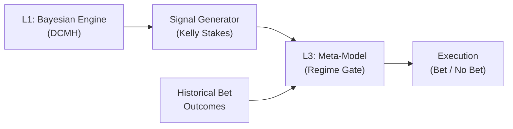

# Layer 3: Regime-Aware Meta-Model — Research & Design Notes

## 1. Problem Statement

Our Layer 1 (L1) Bayesian engine produces match-level predictions. The signal generator converts these into Kelly-optimal stakes across multiple markets (over_25, btts_yes, draw, etc.). The hurdle analysis revealed that:

1. **Some markets are structurally profitable** (over_25, under_25, btts_yes)
2. **Some are structurally unprofitable** (away, home, draw)
3. Profitability likely **shifts over time** — bookmakers adapt, league dynamics change, model drift occurs

We need a **Layer 3 (L3) Meta-Model** that sits above L1 and the signal generator. Its job:

> Given the historical stream of bet outcomes for a specific (model, market) pair, estimate the **current regime** — is this market profitable right now? — and output a **gating signal** that modulates or blocks the L1 Kelly stake before execution.



---

## 2. Mathematical Framework

### 2.1 The Static Hurdle (What We Have)

Our current `BernoulliGammaHurdle` fits a single static distribution to all historical bets in a group:

$$R_i \sim \begin{cases} \text{Gamma}(\alpha, \beta) & \text{w.p. } p \\ -1 & \text{w.p. } 1-p \end{cases}$$

From which we derive the static growth rate:

$$G = \exp\!\Big((1-p)\log(1-\bar{f}) + p \cdot \mathbb{E}[\log(1 + \bar{f} Y)]\Big) - 1, \quad Y \sim \text{Gamma}(\alpha, \beta)$$

**Limitation:** This assumes the data-generating process is stationary. If the bookmaker tightened their over_25 line in month 8, the static fit averages across the good regime (months 1–7) and the bad regime (months 8+), giving you a misleading overall G.

### 2.2 The Dynamic Hurdle (What We Need)

We want the hurdle parameters to **evolve over time**. Let $t$ index time periods (months or matchdays). For each (model, market) pair:

$$p_t, \quad \alpha_t, \quad \beta_t \quad \longrightarrow \quad G_t$$

The question is: how do we model the dynamics of $(p_t, \alpha_t, \beta_t)$?

---

## 3. Three Candidate Formulations

### 3.1 Approach A: Time-Decayed Hurdle (Simplest)

**Idea:** Don't model dynamics explicitly. Instead, re-fit the static hurdle using exponentially time-decayed weights, so recent bets dominate.

$$w_i = 0.5^{\Delta_i / \tau}$$

where $\Delta_i$ is the number of days since bet $i$ and $\tau$ is the half-life.

**Fit:**
- $\hat{p}_t = \frac{\sum_i w_i \cdot \mathbb{1}[R_i > 0]}{\sum_i w_i}$
- Fit weighted Gamma MLE to positive ROIs using weights $w_i$

**Pros:**
- Zero new infrastructure — reuse existing `fit_hurdle_roi` with a weights argument
- Fast, no MCMC required
- Already consistent with your L1 time-decay philosophy

**Cons:**
- No uncertainty quantification on $G_t$
- No explicit regime detection — just recency bias
- Half-life $\tau$ is a hyperparameter you'd need to tune

**Output:** Point estimate of $\hat{G}_t$. Gate = $\mathbb{1}[\hat{G}_t > 0]$

---

### 3.2 Approach B: Bayesian Online Conjugate Updates (Medium)

**Idea:** Use conjugate priors for the Bernoulli and Gamma components, and update them sequentially as new bet outcomes arrive.

**Win probability** — Beta-Bernoulli conjugacy:
$$p_t \sim \text{Beta}(a_t, b_t)$$

Update rule after observing $n_t$ bets with $k_t$ wins in period $t$:
$$a_{t+1} = \lambda \cdot a_t + k_t, \quad b_{t+1} = \lambda \cdot b_t + (n_t - k_t)$$

where $\lambda \in (0, 1)$ is a **forgetting factor** that decays the influence of old data. When $\lambda = 1$, you get standard Bayesian updating (no forgetting). When $\lambda = 0.95$, the effective sample size decays by 5% per period.

**Gamma parameters** — use a Normal-Gamma conjugate for the positive ROI distribution, or simply re-fit the Gamma MLE on the last $N$ winning bets.

**Growth rate posterior:**
Given the posterior $p_t \sim \text{Beta}(a_t, b_t)$ and point estimates $(\hat{\alpha}_t, \hat{\beta}_t)$, compute:

$$P(G_t > 0) = \int_0^1 \mathbb{1}[G(p, \hat{\alpha}_t, \hat{\beta}_t) > 0] \cdot \text{Beta}(p; a_t, b_t) \, dp$$

This can be evaluated by Monte Carlo: sample $p^{(s)} \sim \text{Beta}(a_t, b_t)$, compute $G^{(s)}$ for each, and take the proportion > 0.

**Pros:**
- Gives you $P(G_t > 0)$ — a natural confidence-based scalar output for stake modulation
- Computationally cheap (no MCMC, just parameter updates)
- The forgetting factor $\lambda$ elegantly handles regime shifts
- Uncertainty shrinks with more data, widens during regime changes

**Cons:**
- Gamma parameters aren't conjugate-updated as cleanly as the Bernoulli
- Doesn't capture cross-market correlation (each market is independent)
- $\lambda$ is still a hyperparameter

**Output:** $P(G_t > 0) \in [0, 1]$. Use as:
- Binary gate: bet if $P(G_t > 0) > 0.6$
- Scalar modulator: multiply Kelly stake by $P(G_t > 0)$

---

### 3.3 Approach C: Full Turing State-Space Model (Richest)

**Idea:** Model the latent regime state as a time-varying parameter in a Turing.jl model. Use AR(1) dynamics on the logit/log-transformed hurdle parameters.

#### Observation Model

For each bet $i$ in time period $t$ (month), market $k$:

$$\text{win}_i \sim \text{Bernoulli}(p_{t,k})$$

$$R_i \mid \text{win} \sim \text{Gamma}(\alpha_{t,k}, \beta_{t,k})$$

#### Latent Dynamics (AR(1) with Mean Reversion)

$$\text{logit}(p_{t,k}) = \mu_{p,k} + \phi_p \cdot (\text{logit}(p_{t-1,k}) - \mu_{p,k}) + \epsilon_{p,t}, \quad \epsilon_{p,t} \sim N(0, \sigma_p^2)$$

$$\log(\alpha_{t,k}) = \mu_{\alpha,k} + \phi_\alpha \cdot (\log(\alpha_{t-1,k}) - \mu_{\alpha,k}) + \epsilon_{\alpha,t}$$

$$\log(\beta_{t,k}) = \mu_{\beta,k} + \phi_\beta \cdot (\log(\beta_{t-1,k}) - \mu_{\beta,k}) + \epsilon_{\beta,t}$$

Where:
- $\mu_{p,k}$ : long-run average win rate for market $k$ (logit scale)
- $\phi_p \in (0, 1)$ : persistence parameter. High $\phi$ = slow regime shifts. Low $\phi$ = fast adaptation.
- $\sigma_p$ : innovation variance (how much the regime can shift per period)

#### Derived Quantity

At each time step, the posterior over $(p_t, \alpha_t, \beta_t)$ gives a **posterior over $G_t$**:

$$G_t = f(p_t, \alpha_t, \beta_t, \bar{f}_t)$$

The full posterior $P(G_t > 0 \mid \text{data}_{1:t})$ is available from the MCMC chain.

#### Hierarchical Extension

Share the dynamics parameters $(\phi, \sigma)$ across markets:

$$\phi_p \sim \text{Beta}(a_\phi, b_\phi) \quad \text{(shared across markets)}$$

This means the model learns a single "regime change speed" from all markets simultaneously, while allowing each market's level ($\mu_{p,k}$) to differ.

**Priors:**
```
μ_p,k    ~ Normal(0, 1)          # logit scale, weakly informative
μ_α,k    ~ Normal(log(20), 0.5)  # informed by static hurdle fits (~20)
μ_β,k    ~ Normal(log(0.05), 0.5)
φ        ~ Beta(5, 2)            # prior toward persistence (≈0.7)
σ_p      ~ HalfNormal(0.3)       # small innovations
σ_α      ~ HalfNormal(0.1)
σ_β      ~ HalfNormal(0.1)
```

**Pros:**
- Full posterior over $G_t$ — the richest uncertainty quantification
- AR(1) naturally handles both gradual drift and sudden regime shifts
- Hierarchical structure borrows strength across markets
- Directly implemented in your existing Turing.jl infrastructure
- The persistence parameter $\phi$ is **learned from data**, not a hyperparameter

**Cons:**
- Requires MCMC (but this is a tiny model — seconds to fit, not hours)
- Needs enough time periods (months) to estimate dynamics — at least 12–18
- More complex to implement and validate

**Output:** Full posterior $P(G_t > 0 \mid \text{data})$ from MCMC chain.

---

## 4. System Architecture

### 4.1 Where L3 Sits

```
┌─────────────────────────────────────────────────┐
│                  TRAINING PHASE                 │
│                                                 │
│  Historical Bets → Group by (model, market)     │
│       → Fit L3 Meta-Model per group             │
│       → Extract regime posteriors                │
│       → Store gating parameters                 │
└─────────────────────────────────────────────────┘
                        │
                        ▼
┌─────────────────────────────────────────────────┐
│                 INFERENCE PHASE                 │
│                                                 │
│  L1 produces match predictions                  │
│       → Signal generator proposes Kelly stakes  │
│       → L3 looks up P(G_t > 0) for market k    │
│       → Modulate: stake' = stake × gate(k, t)  │
│       → Execute modulated stake                 │
└─────────────────────────────────────────────────┘
```

### 4.2 The Gate Function

Three options, from conservative to aggressive:

**Binary Gate (Safest):**
$$\text{gate}(k, t) = \mathbb{1}\big[P(G_{t,k} > 0) > \delta\big], \quad \delta \in [0.5, 0.8]$$

**Soft Gate (Balanced):**
$$\text{gate}(k, t) = P(G_{t,k} > 0)$$

Multiplying the Kelly stake by the probability of positive growth. If the model is 90% sure the regime is profitable, you bet at 90% Kelly. If it's 50/50, you bet at half Kelly — which is exactly the right thing to do under uncertainty.

**Sigmoid Gate (Tunable):**
$$\text{gate}(k, t) = \sigma\big(\kappa \cdot (E[G_{t,k}] - G_{\min})\big)$$

A sigmoid centered on a minimum growth threshold $G_{\min}$, with steepness $\kappa$. This gives a smooth 0→1 transition and lets you set a minimum acceptable growth rate.

### 4.3 Data Flow

```julia
# Proposed types
struct MetaModelConfig
    approach::Symbol           # :time_decay, :conjugate, :state_space
    gate_type::Symbol          # :binary, :soft, :sigmoid
    threshold::Float64         # δ for binary, G_min for sigmoid
    forgetting_factor::Float64 # λ for conjugate approach
end

struct RegimeState
    market::Symbol
    period::Int
    p_positive_growth::Float64  # P(G_t > 0)
    expected_growth::Float64    # E[G_t]
    gate_value::Float64         # Final [0,1] modulator
end
```

---

## 5. Recommended Implementation Path

### Phase 1: Time-Decayed Hurdle (Week 1)

Start with Approach A. This requires minimal new code:
- Add a `weights` argument to `fit_hurdle_roi`
- Compute weights from bet dates using your existing `calculate_match_weights`
- Add a `rolling_hurdle_G` column to the tearsheet
- Validate: does the time-decayed G give earlier warning signals than the static G?

This gives you immediate value and a baseline to compare against.

### Phase 2: Bayesian Conjugate Gate (Week 2)

Build Approach B as a proper `current_development/` prototype:
- `l00_meta_model.jl`: Beta-Bernoulli online updater + Gamma refitter
- `r00_meta_model.jl`: Run over historical bet stream, plot P(G_t > 0) over time

Key validation: plot $P(G_t > 0)$ over time for the `away` market. You should see it starting uncertain (≈0.5), briefly spiking after lucky wins, but converging toward 0 as evidence accumulates. For `over_25`, it should converge toward 1.

### Phase 3: Full Turing State-Space (Week 3+)

If Phase 2 shows that regime dynamics matter (i.e., profitability genuinely shifts over time rather than being constant), build Approach C:
- Group bets by month
- Build the AR(1) Turing model with hierarchical dynamics
- Extract posterior $P(G_t > 0)$ per market per month
- Integrate as a gate in the backtesting pipeline

### Phase 4: Integration

Wire the chosen approach into the backtesting pipeline:
```julia
# In processor.jl or signal processing
function apply_meta_gate!(bets_df, meta_model, current_period)
    for row in eachrow(bets_df)
        gate = get_gate_value(meta_model, row.selection, current_period)
        row.stake *= gate
    end
end
```

---

## 6. Key Design Decisions to Make

| Decision | Options | Recommendation |
|----------|---------|----------------|
| Time granularity | Per-bet / Weekly / Monthly | **Monthly** — matches L1 interception, enough data per period |
| Market grouping | Per-selection / Per-market-type | **Per-selection** (over_25, btts_yes, etc.) — they have different dynamics |
| Cross-market sharing | Independent / Hierarchical | **Hierarchical** for Phase 3 — borrow strength on $\phi$ |
| Gate output | Binary / Soft / Sigmoid | **Soft gate** $P(G > 0)$ — most principled, naturally scales stakes |
| Warm-up period | How many months before L3 activates? | **6 months** — need enough data for the Beta posterior to be informative |

---

## 7. Mathematical Note: Why AR(1) and Not a Random Walk

A Gaussian Random Walk (GRW) on logit($p_t$) has no mean reversion:

$$\text{logit}(p_t) = \text{logit}(p_{t-1}) + \epsilon_t$$

This implies the regime can drift arbitrarily far from the starting point. Over long horizons, the win probability would random-walk to 0 or 1, which is unrealistic.

AR(1) with mean reversion:

$$\text{logit}(p_t) = \mu + \phi(\text{logit}(p_{t-1}) - \mu) + \epsilon_t$$

This says: the regime can shift, but it's pulled back toward a long-run equilibrium $\mu$. This is the right physics for betting markets — bookmakers might temporarily misprice a market, but competitive pressure pulls them back toward efficiency. The speed of that pull-back is controlled by $\phi$:

- $\phi \to 1$: Very persistent regimes (slow bookmaker adaptation)
- $\phi \to 0$: Fast mean reversion (efficient market, regimes are fleeting)
- $\phi$ learned from data tells you something deep about the market you're trading in

---

## 8. Connection to Existing Architecture

| L3 Concept | Existing L1 Analogue | Notes |
|------------|---------------------|-------|
| AR(1) on logit(p) | `DynamicsConfig` (GRW on attack/defence) | Same pattern, different domain |
| Monthly time periods | `HierarchicalMonthlyInterception` | Reuse same temporal structure |
| Hierarchical across markets | `HierarchicalTeamDixonColesConfig` | Share dynamics, vary levels |
| Forgetting factor λ | `days_half_life` in time decay | Same exponential decay concept |
| Gate function | Kelly fraction (already modulates stakes) | Natural extension point |

The L3 meta-model is architecturally a **mirror** of your L1 model, just operating on a different data stream (bet outcomes instead of match outcomes) and at a different time scale (monthly instead of per-match).
